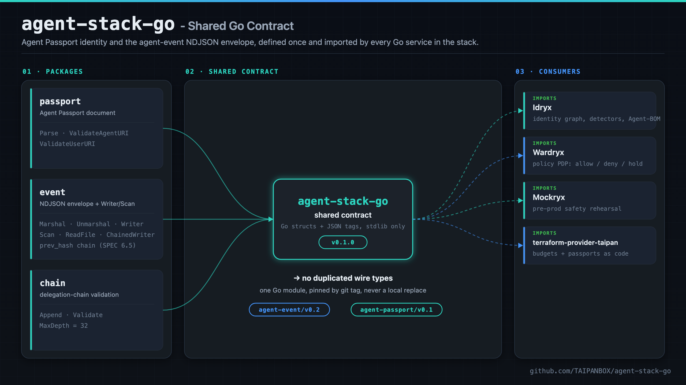
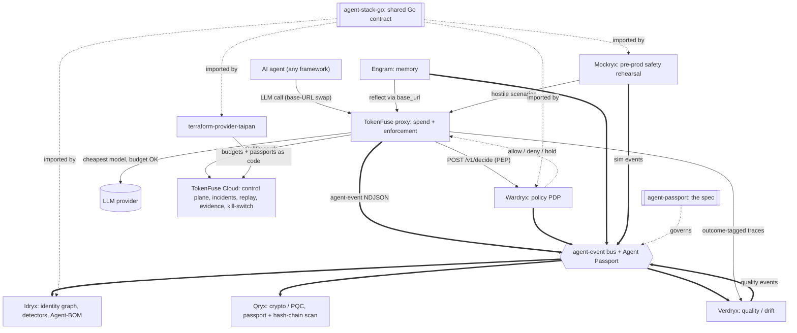
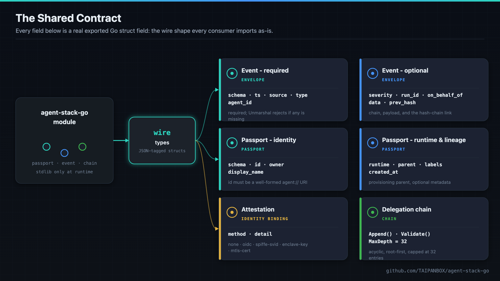

<div align="center">

# agent-stack-go - Shared Go Contract

**One Go module for Agent Passport identity and the agent-event NDJSON envelope, so every service in the stack speaks the same wire language instead of reimplementing it.**

[](https://github.com/TAIPANBOX/agent-stack-go/actions/workflows/ci.yml)
[](https://pkg.go.dev/github.com/TAIPANBOX/agent-stack-go)




</div>

agent-stack-go is the public, importable home of the wire types every Go
service in the TAIPANBOX agent-governance stack (Wardryx, Mockryx, and
future siblings) needs to speak the same identity and event language as
TokenFuse, Idryx, Qryx, and Engram. Idryx's equivalents live under
`internal/` and cannot be imported outside that repo, which is why this
module exists: one shared source, not four drifting copies.

The stack this module supports is a defensive, self-protection system: it
exists so an organization running AI agents can govern and audit its own
agents, never to attack, surveil, or act against anyone else.

---

## Where this fits in the stack

agent-stack-go is the shared-contract plane of the TAIPANBOX agent-governance stack: the Go bindings for Agent Passport identity and the agent-event NDJSON envelope that the stack's other Go services import instead of reimplementing.



- **Consumes**: the **agent-passport** spec, which its `passport` and `event` packages conform to (checked by a schema conformance test).
- **Produces**: shared Go types for the Agent Passport document, the agent-event NDJSON envelope, and delegation-chain validation.
- **Talks to**: imported by **Idryx**, **Wardryx**, **Mockryx**, and **terraform-provider-taipan**, so all four speak the same identity and event language as **TokenFuse**, **Qryx**, and **Engram**.

The full stack is TokenFuse (spend), Wardryx (policy), Engram (memory), Idryx (access), Qryx (crypto), Verdryx (quality), Mockryx (pre-prod), on the shared Agent Passport + agent-event contract (agent-stack-go / agent-passport), configured via terraform-provider-taipan.

Run the whole open stack locally with one command via [**stack-up**](https://github.com/TAIPANBOX/stack-up); the stack's home on the web is [**it-rat.com**](https://it-rat.com).

---

## The shared contract

<div align="center">

</div>

Three packages, one contract, stdlib plus exactly one vetted dependency
(`github.com/gowebpki/jcs`, the RFC 8785/JCS canonicalization the
`prev_hash` integrity chain hashes over - canonical JSON is precisely the
kind of wheel not to hand-roll):

| Package | Wire schema | What it defines |
|---|---|---|
| `passport` | `taipanbox.dev/agent-passport/v0.1` | the Agent Passport document: identity, owner, runtime, provisioning parent, attestation posture |
| `event` | `taipanbox.dev/agent-event/v0.2` (v0.1 still accepted) | the agent-event NDJSON envelope, plus an append-only `Writer`, tolerant `Scan`/`ReadFile` readers, and the `ChainedWriter`/`VerifyChain` SPEC 6.5 `prev_hash` integrity chain (`Canonicalize`/`ChainHash`) |
| `chain` | n/a (a v0.2 normative rule) | delegation-chain helpers: acyclic, root-first, capped at `chain.MaxDepth` (32) entries |

### `event.Event` - the agent-event envelope

| Field | JSON key | Type | Required | Notes |
|---|---|---|---|---|
| `Schema` | `schema` | `string` | yes | `SchemaV02` or `SchemaV01` |
| `TS` | `ts` | `string` | yes | timestamp, not shape-validated by `Unmarshal` |
| `Source` | `source` | `string` | yes | the emitting service |
| `Type` | `type` | `string` | yes | the event type |
| `AgentID` | `agent_id` | `string` | yes | `agent://` URI of the acting agent |
| `Severity` | `severity` | `string` | no | `info` · `low` · `medium` · `high` · `critical` |
| `RunID` | `run_id` | `string` | no | correlates events within one run |
| `OnBehalfOf` | `on_behalf_of` | `[]string` | no | the delegation chain (see package `chain`) |
| `Data` | `data` | `map[string]any` | no | the event payload |
| `PrevHash` | `prev_hash` | `string` | no | the SPEC §6.5 integrity-chain link; stamped by `ChainedWriter`, verified by `VerifyChain` |

`Unmarshal` returns a sentinel error (`ErrMissingSchema`, `ErrMissingTS`,
`ErrMissingSource`, `ErrMissingType`, `ErrMissingAgentID`) for any missing
required field, checkable with `errors.Is`. Struct fields are declared in
wire order, so `json.Marshal`'s output matches the Rust
(`tokenfuse-core::agent_event`) and Python (`engram.events`) exporters
shipping elsewhere in the stack.

### The `prev_hash` integrity chain (SPEC §6.5)

`ChainedWriter` is `Writer` plus the chain: every appended event carries
`sha256:` + hex(sha256(C)) of the PREVIOUS event, where C is its RFC 8785
(JCS) canonical serialization with the `prev_hash` field removed. One
file is one chain: reopening resumes from the tail, so a process restart
does not fork the chain (an unreadable tail starts fresh, fail-open, and
a verifier shows the restart honestly). `Canonicalize`/`ChainHash` are
the exported primitives; `VerifyChain` walks a stream and reports
genuine breaks separately from legal restarts and unverifiable links (a
rotated segment's first line, or the line after a malformed one).
`agent-conform -chain <file>` runs the same verification from the CLI.
The chain is tamper-EVIDENCE, not tamper-proof: whole-file rewrites can
re-chain; partial edits, truncation and reordering no longer pass
silently. Cross-language pinned vectors live in
`event/testdata/chain-vectors.json`; the Rust (`tokenfuse`) and Python
(`engram`, `verdryx`) emitters pin the same bytes.

### `passport.Passport` - the Agent Passport document

| Field | JSON key | Type | Required | Notes |
|---|---|---|---|---|
| `Schema` | `schema` | `string` | yes | must equal `RequiredSchema` |
| `ID` | `id` | `string` | yes | `agent://` URI, checked by `ValidateAgentURI` |
| `Owner` | `owner` | `string` | yes | the owning team or human |
| `DisplayName` | `display_name` | `string` | no | |
| `Runtime` | `runtime` | `string` | no | |
| `Parent` | `parent` | `string` | no | static provisioning parent |
| `Attestation` | `attestation` | `*Attestation` | no | how the id is bound to a workload |
| `Labels` | `labels` | `map[string]string` | no | |
| `CreatedAt` | `created_at` | `string` | no | |

`Attestation.Method` is one of `none` · `oidc` · `spiffe-svid` ·
`enclave-key` · `mtls-cert`; `Attestation.Detail` is a method-specific
reference (a SPIFFE ID, an issuer URL, …).

| Function | Signature | Behavior |
|---|---|---|
| `LoadDir` | `LoadDir[T any](dirOrGlob string, parse func([]byte) (T, error), id func(T) string) ([]T, Report, error)` | reads every file under a directory/glob/literal path in sorted order, decoding each with `parse`; a file that fails `parse` is counted in `Report.Malformed` and skipped, never fatal; duplicate `id` keys keep the first occurrence in sorted-path order |

`LoadDir` is generic over the parsed type, not tied to `Passport`: pass
`passport.Parse` and an `ID`-extractor for a batch of Passport documents
(the shape Wardryx's `internal/passports` and Idryx's
`internal/ingest/passport` both need), or any other `func([]byte) (T, error)`
for a different kind of file batch.

### `chain` - delegation-chain helpers

| Function | Signature | Behavior |
|---|---|---|
| `Append` | `Append(chain []string, principal string) ([]string, error)` | returns a new chain with `principal` appended; never mutates the input; `ErrCycle` if already present, `ErrTooDeep` past `MaxDepth` |
| `Validate` | `Validate(chain []string) error` | checks acyclic, ≤ `MaxDepth` (32), every entry an `agent://` or `user://` URI |

A nil or empty chain is valid: per the spec, it means the agent acts
autonomously.

---

## Install

```sh
go get github.com/TAIPANBOX/agent-stack-go@v0.2.0
```

Pin to a tagged release, not to `@latest` and never to a local `replace`
(see [Versioning](#versioning)).

## Usage

```go
package main

import (
	"fmt"

	"github.com/TAIPANBOX/agent-stack-go/event"
	"github.com/TAIPANBOX/agent-stack-go/passport"
)

func main() {
	e := event.Event{
		Schema:   event.SchemaV02,
		TS:       "2026-07-09T03:12:44.100Z",
		Source:   "wardryx",
		Type:     "policy_deny",
		AgentID:  "agent://acme-bank.example/support/tier1-bot",
		Severity: event.SeverityHigh,
		RunID:    "run-8842",
		Data:     map[string]any{"reason": "budget_exceeded"},
	}
	line, err := event.Marshal(e)
	if err != nil {
		panic(err)
	}
	fmt.Println(string(line))

	p, err := passport.Parse([]byte(`{
		"schema": "taipanbox.dev/agent-passport/v0.1",
		"id": "agent://acme-bank.example/support/tier1-bot",
		"owner": "user://acme-bank.example/support-team"
	}`))
	if err != nil {
		panic(err)
	}
	fmt.Println(p.ID, p.Owner)
}
```

## Command-line tool: `agent-conform`

```sh
go install github.com/TAIPANBOX/agent-stack-go/cmd/agent-conform@main
agent-conform passport.json events.ndjson
```

(`@main`, not a tag: this tool landed after `v0.2.0`; switch to whatever
tag first includes it once one exists, per [Versioning](#versioning).)

The standalone conformance checker: validates Passport documents and
agent-event NDJSON streams against the canonical JSON Schemas, the check
agent-passport's own README names as not existing yet ("conformance is
verified per-repo... by hand"). Stricter than `passport.Parse`/
`event.Unmarshal` (which only enforce required-field presence) -- full
schema validation, including patterns like the `agent://` URI grammar and
`prev_hash`'s exact 64-hex-char form. Each file is classified by its own
`schema` field, not extension, mirroring the same convention every
connector in the stack already uses. Exit code 0 means every file (and
every line within an event stream) conforms; 1 means at least one did not.

## Design notes

- Stdlib only at runtime for `passport` and `chain`: no third-party
  dependency is ever required to import and use them. `event` additionally
  requires `github.com/gowebpki/jcs` (RFC 8785/JCS canonicalization) at
  runtime, for the `prev_hash` integrity chain (`ChainedWriter`/
  `VerifyChain`, see above). `github.com/santhosh-tekuri/jsonschema/v6` is
  used by `event`'s conformance test and, as a real (non-test) dependency,
  by `cmd/agent-conform` -- a consumer importing only the library packages
  never pulls in jsonschema; only building the standalone tool does.
- Each package mirrors an existing internal implementation elsewhere in the
  stack (Idryx's `internal/ingest/passport` and `internal/ingest/tokenfuse`,
  TokenFuse's `tokenfuse-core::agent_event`, Engram's `engram.events`) rather
  than inventing new semantics, so adopting it is a rename, not a rewrite.
- Errors are sentinel values, checkable with `errors.Is`, not opaque strings,
  so callers can branch on failure kind without string matching.
- Malformed input is tolerated the same way the existing Idryx connectors
  tolerate it: a bad NDJSON line or passport document is skipped and
  counted, never fatal to the rest of a batch.

The canonical JSON Schemas live in the `TAIPANBOX/agent-passport` repo.
`event/testdata/agent-event.v0.2.schema.json` is a local copy used only by
this module's conformance test, so the Go bindings can never silently drift
out of lockstep with the schema that defines the wire contract.
`cmd/agent-conform/schemas/*.json` are separate local copies of all three
schemas (Passport, event v0.1, event v0.2), embedded into that tool via
`go:embed` for the same reason.

## Versioning

This module follows SemVer, starting at `v0.1.0`. Breaking the wire contract
(the `passport` or `event` schema) is a spec version bump, never a silent
change; the Go types version alongside the module itself. Consumers pin it
by tag (`go get github.com/TAIPANBOX/agent-stack-go@v0.2.0`), never a local
`replace`.

---

## Status

- [x] `passport`: `Parse`, `ValidateAgentURI`, `ValidateUserURI`, sentinel errors
- [x] `event`: `Marshal`, `Unmarshal`, append-only `Writer`, `Scan`/`ReadFile` NDJSON readers, `ChainedWriter`/`VerifyChain` SPEC 6.5 `prev_hash` integrity chain, `Canonicalize`/`ChainHash`
- [x] `chain`: `Append`, `Validate`, `MaxDepth` = 32, acyclic + root-first
- [x] conformance test against the canonical `agent-event` v0.2 JSON Schema
- [x] `passport.LoadDir`: shared batch loader (resolve dir/glob/file, sorted, tolerant, first-seen-id dedup), extracted out of Wardryx's and Idryx's independent copies
- [x] `v0.2.0` tagged; CI green on `gofmt`, `go vet`, `staticcheck`, `go test -race`, `go build`, `govulncheck`
- [x] `cmd/agent-conform`: standalone conformance-check CLI, full JSON Schema
  validation (Passport documents + event v0.1/v0.2) against embedded copies
  of the canonical schemas; live-verified against real fixtures elsewhere
  in the stack, catching a real 63-vs-64-hex-char `prev_hash` defect

This module's package set (`passport`, `event`, `chain`) covers everything the
stack's current Go consumers need; it is not a fixed, closed list, and grows
opportunistically the same way `passport.LoadDir` did (extracted once two
independent copies existed, not speculatively).

## License

[Apache-2.0](./LICENSE).
